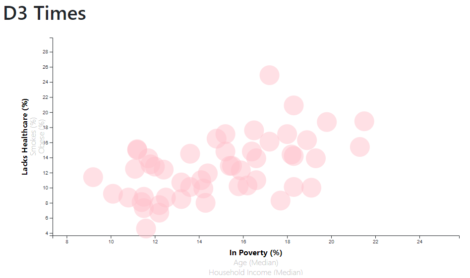
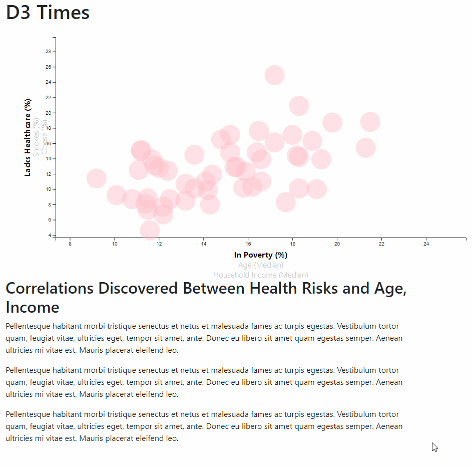

# D3 Challenge - Data Journalism and D3

## Background

This repository uses D3 to visualize data. The scenario is that I've just accepted a data visualization position for a fictional major metropolitan paper. This paper wanted me to analyze the current trends that are shaping people's lives as well as creating charts, graphs, and interactive elements to help all readers understand our findings. 

Our editor wanted to run a series of feature stores about the health risks facing particular demographics. I would gather this data by sifting through information from the U.S. Census Bureau and the Behavioral Risk Factor Surveillance System.

The data set that is used for this repository is derived from the 2014 ACS 1-year estimates from the US Census Bureau. It includes data on the rates of healthcare, income, obesity, poverty, etc. by state. MOE stands for "margin of error". In this directory, the data is stored [here](D3_data_journalism/assets/census_Journalism_data.csv).

## Core Task: D3 Dabbler

My main core task was to create a scatter plot between two of the data variables. I started with `Healthcare vs. Poverty`.

Using D3 Techniques, I created a scatter plot that represented each state with circle elements. The code for this graphic is written in the [app.js](D3_data_journalism/assets/app.js) file within my assets folder. Within this graphic I made sure that I created and situated my axes and labels to the left and bottom of the chart.

Currenly I'm working on being able to include state abbreviations in the circles.

## Bonus Task

To improve the graphic, I turned it from a static one and made it more interactive.

## Chart Preview

### More Data

First, I placed additional labels in the scatter plot; age and income in the x-axis, smoking and obesity in the y-axis. Then, I gave them all click events giving users a choice of which data to display. When the click event happens, I animated the transitions for your circles' locations as well as the range of my axes. 

To help with this process I binded all of the CSV data to my circles, which let me easily determine the x or y values when one clicks the labels.

### Incorporating D3-Tip

To help users know exactly the precise data points from comparing variables, I added tooltips to each circle to reveal a specific element's data whenever a user hovers their cursor over the element. To accomplish this, I used the ``d3-tip.js` plugin developed by [Justin Palmer](https://github.com/Caged).